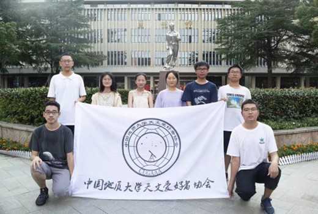

# 2021.06-2022.06

## 作者：买鸿轩、高安童

### 2020级管理层
- 社长：孙嘉奕（地院）
- 副社长：丁乙（地信）、陈木子（地信）
- 学术部长：李嘉蹊（地空）
- 宣传部长：彭欣茹（经管）、常贺瑞（数理）
- 技术部长：刘劼（地信）、买鸿轩（地空）

---
## 编者按
由于买哥所著部分体例独特，记述详实，不宜再进行大范围修订整理，遂将原文陈列如下，编者仅作必要的补充）

---
## 地大天文爱好者协会史实录第八卷
起2021年6月13日换届会议，止2022年7月9日社区科普活动

注：由于高总编修让大家只写自己在任那学年的情况，并且没有把20-21年的实录给我看，所以我并不知道上一卷中是否介绍了我是谁，因此有必要向后来者做个简短的自我介绍。我，买鸿轩，新疆乌鲁木齐人氏，地球物理与空间信息学院20级本科生。与我同班的人中有一位早在20年9月入学前的暑假就加入司天台水群的同学，名为李嘉蹊。我是在20年9月的某一天在QQ空间填写了他转发的天协招新表格，从而加入你协的。我最初被编在宣传部，部长是19级的孙家淮学长。在宣传部将写记仇录的工作交给技术部之前，我有幸写过两篇。那一学年我参加路边天文的次数并不多，主要工作是登录地大天协账号，发布公告以及在司天台进行每周科普。当然这些工作都是轮流制的，我只做过一次每周科普。21年6月的一天，孙学长询问我愿不愿意留部，也就是担任下一学年的部长，经过一番思想斗争，我最终答应了他。我竞选的是宣传部长，宣传部另一位愿意留部的是公管学院的彭欣茹同学。但最后我却被选作了技术部长。根据参与决策的人员事后透露，是因为技术部的候选人比较忙，因此调我去了技术部。
 
### 纪事
2021年6月13日下午，天协18、19级管理层与20级候选人在大活演播厅举行换届会议。我们从社团拾光旁边的小门经过后台进入演播厅，在靠东面的位置摆了半圈椅子，逐次发言。首先19级管理层的三位同学进行了述职，他们分别是：学术部长琚苏婷、宣传部长孙家淮以及技术部长张浩政。随后20级候选人发言，各自叙述自己对竞选职位的认识以及对未来工作的规划。所有发言结束后，18、19级管理层（还有17级的熊晋甲）进行投票表决，他们走到舞台后进行讨论，随后向我们公布换届结果。于是20级的新人建了管理群，并互相加了好友。

> 2021年6月13日换届后新管理层合影
> 
> 前排左：常贺瑞；右：李嘉蹊；后排左一：买鸿轩；左二：陈木子；左三：孙嘉奕；后排右一：刘劼；右二：丁乙；右三：彭欣茹。
重要事件

> 图片注释
> 
### 重要事件2：

---
## 日常记录
### 记录1：

### 记录2：

---
## 轶事
- 轶事1
- 轶事2
