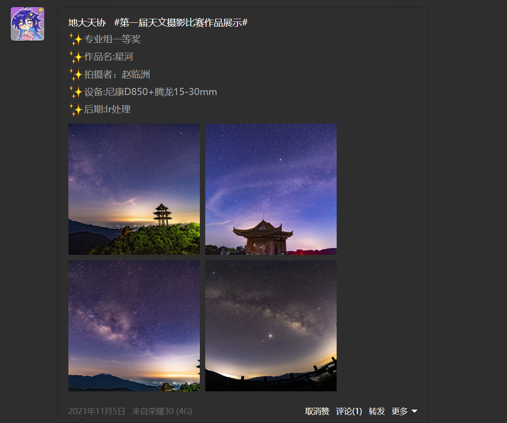
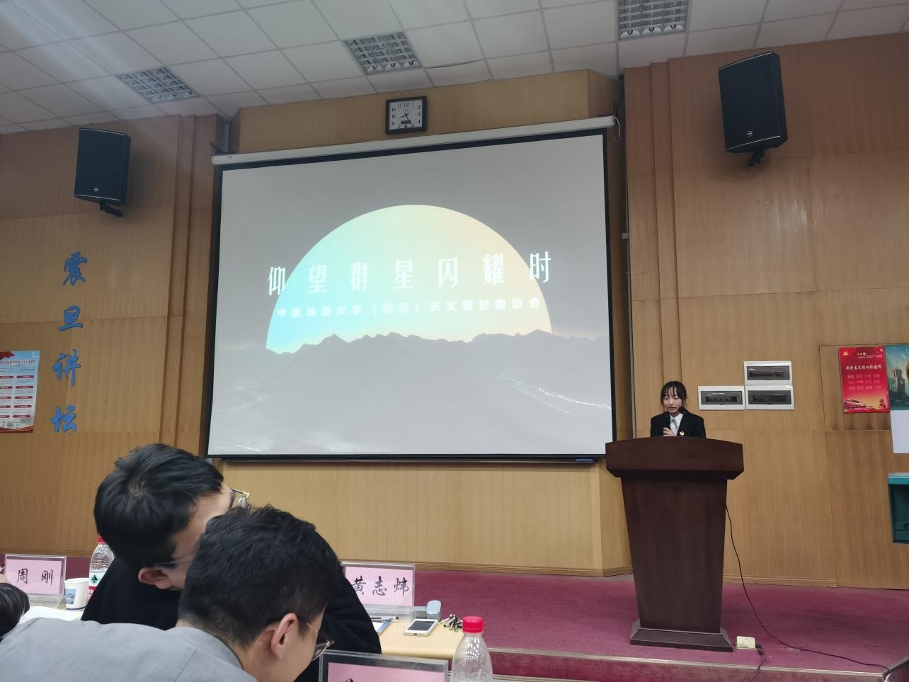
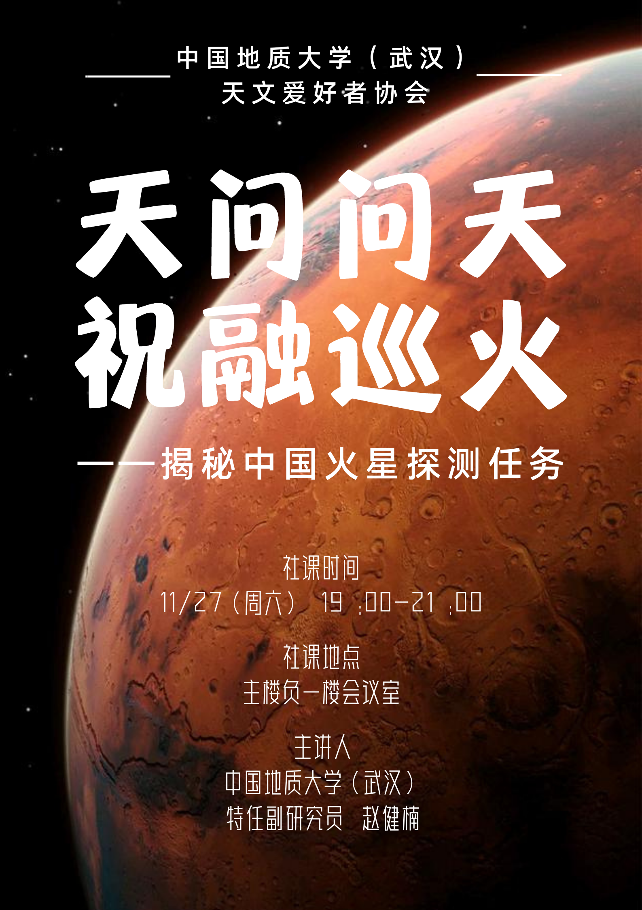
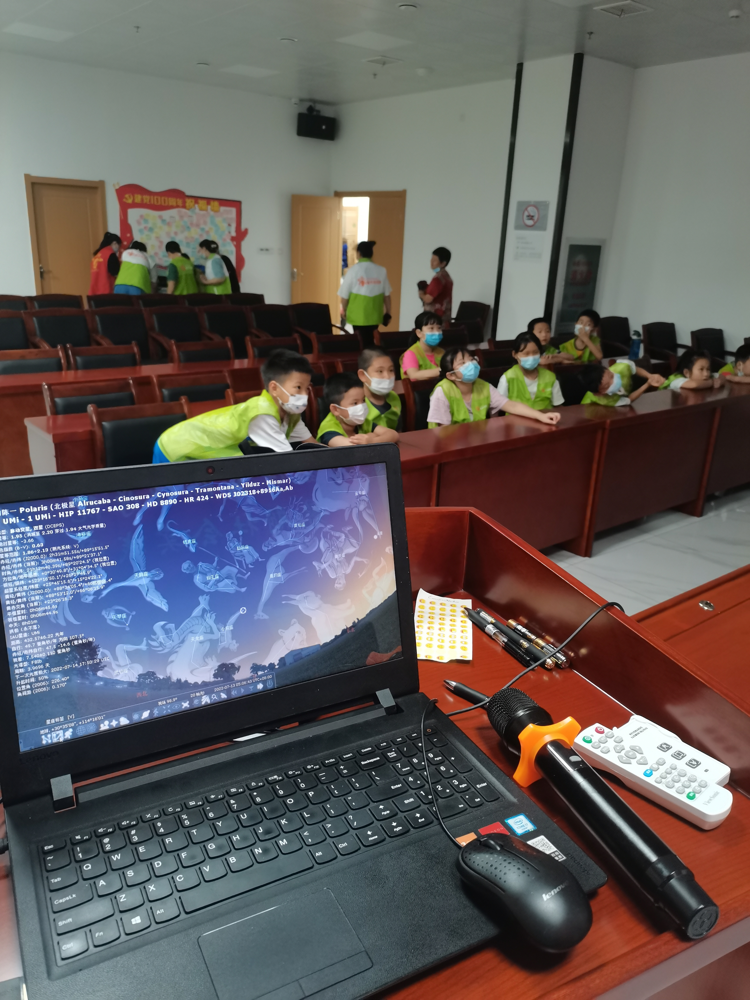

# 2021.06-2022.06

## 作者：买鸿轩、高安童

### 2020级管理层
- 社长：孙嘉奕（地院）
- 副社长：丁乙（地信）、陈木子（地信）
- 学术部长：李嘉蹊（地空）
- 宣传部长：彭欣茹（经管）、常贺瑞（数理）
- 技术部长：刘劼（地信）、买鸿轩（地空）

---
## 重要事件
### 重要事件1：2021年换届大会
2021年6月13日下午，天协18、19级管理层与20级候选人在大活演播厅举行换届会议。我们从社团拾光旁边的小门经过后台进入演播厅，在靠东面的位置摆了半圈椅子，逐次发言。首先19级管理层的三位同学进行了述职，他们分别是：学术部长琚苏婷、宣传部长孙家淮以及技术部长张浩政。随后20级候选人发言，各自叙述自己对竞选职位的认识以及对未来工作的规划。所有发言结束后，18、19级管理层（还有17级的熊晋甲）进行投票表决，他们走到舞台后进行讨论，随后向我们公布换届结果。于是20级的新人建了管理群，并互相加了好友。

> 2021年6月13日换届后新管理层合影
>
> 前排左起：常贺瑞、李嘉蹊；后排左起：买鸿轩、陈木子、孙嘉奕、彭欣茹、丁乙、刘劼。

刘劼同学对天协的发展提出了四条建议，包括1、更改天协隧道壁画：当时的壁画图案仅有一棵大树和夕阳背景，缺乏天文属性，主题并不鲜明，因此建议加上艺术化的深空天体形象以突出主题并吸引路人的关注；2、面向学校开展摄影活动或知识竞赛活动，提升天协在地大乃至武天联的知名度；3、使用行星摄像头丰富路边天文活动的观测方式，组织拍摄活动以增强路边天文的趣味性，根据每月或每季度的作品评比颁发一定的奖励；4、增加技术交流社课，让上述拍摄照片较好的同学分享经验并交流技术。这些建议极具建设性，天协之后的发展在很大程度上与之相合，但由于南望山缺乏技术骨干，其中的第三、四条未得到较好的实践，令人感到遗憾。开完会后，大家去隧道壁画处合影，然后同去校外吃饭，最终选定鲁磨路上的老五烧烤。17级的两位同学也参与了聚餐。会后丁乙和刘劼同学完成了摄影比赛的策划草案，在经过讨论和修改后，形成了最终方案。于是在该学期社团停止活动之前，我们启动了摄影大赛，进行了宣传活动。

### 重要事件2：筹办第一届天文摄影大赛
在那个学期最后的几周里，我们首先策划的是面向全校的第一届天文摄影大赛。6月21日晚上我们开了腾讯会议，讨论策划事宜。比赛分为专业组和非专业组，通过地大天协QQ号、地大司天台群进行宣传。暑假为素材准备期，供参赛选手准备参赛作品，9月1日到25日期间提交作品到地大天协QQ邮箱，作品经过初审和专业评选后于10月11日至15日进行结果公示。每一组设有一等奖（奖品为一个行星探测器模型和一份证书）、二等奖（奖品为一本天文科普书和一份证书）、三等奖（奖品为一套定制明信片和一份证书）。值得一提的是，二等奖的书和三等奖的明信片我们计划找肖龙老师签名，这个决定在后续造成了一些麻烦与异议。社联不允许使用老师签名作为奖品，学长学姐认为这样似乎有消费肖老师的嫌疑，而后来因为我和其他人沟通交流的不及时，导致签名明信片数量不够，少了给几位评委的那一份，让负责联系评委的同学很为难。所幸肖老师非常和蔼，后来我找到他新签了几份，补上了这一部分缺口。

> 摄影大赛部分结果

### 重要事件3：青春地标答辩
每年12月是社团评选各种奖项的时间，一般由社长参加答辩。在这一年你协提名了地学院年度十大人物，展板在操场旁边摆放了很久。答辩安排在一个晚上，地点在教三，社长孙嘉奕同学着正装上台。在高安童学长的建议下，路边天文活动和答辩同时进行，答辩过程中社长向观众介绍路边并邀请大家参加路边。这次答辩大家主要想传达的主旨是，天协不是一个非常功利、拥有或追求很多硬性荣誉的社团，我们只是一群普通的爱好者，在西操稀疏的星空下相遇，我们的目的仅仅是玩的开心。这样的主旨自然不会很对评委老师胃口，但是从那时起我们逐渐发现，对于你协，地院“十大人物”的提名其实比获选更加重要：因为提名理论上可以年年提，获得500r奖金；但评选后至少三年内不能再次评选，这样不如提名划算。

> 孙嘉奕同学在会场上

### 重要事件4：赵健楠老师讲社课
11月25日开展了第三次社课，学术部邀请到行科所的赵健楠老师来讲，主题是《天问问天 祝融巡火：揭秘中国火星探测任务》。

> 社课海报

### 重要事件5：数理志愿活动
在换届前后，数理学院的辅导员孙宇涛老师找到天协，希望能够派出一位同学参与他组织的暑假下社区科普活动。他带领数理学院党建办的同学策划了一次为期半个月的社区科普活动。他购入了一台铝脚信达小黑，赤道仪为EQ3d，希望找一位能够操作望远镜的同学和他的团队一起在暑假去社区托管班进行科普教学，一同被邀请的还有逸夫讲解队和海洋学院的同学。考虑到这样能够加志愿时长，我代表你协参加了这个活动。7月14日我们完成了最后一次科普活动，但这个组织并没有解散，后续依托孙老师整合的这些资源，本次活动的主要成员改组为“大我志愿服务队”。我没有继续跟进，而是向他们推荐了天协新任的管理袁钰斌同学，后续数理学院的天文兴趣小组即从此来。

> 在社区给小朋友做科普
>

---
## 日常记录
### 记录1：管理层技术培训
丁乙和刘劼早在20年入学后就参加了技术部，并用C925和小黑完成了太阳系全家福的拍摄工作，他们是技术部的真正主力。但由于大二以后他们要搬去未来城校区，因此南望山的技术部一下子变得有些空虚。他们在换届后特意为南望山的管理人员进行了望远镜技术培训。那是一个傍晚，我们将小黑从56栋江博源学长宿舍取出，就近选择了56栋后面宿舍服务中心前的空地进行操作。他俩展示了小黑的组装、手动操作以及电动导星跟踪系统（Onstep）的使用方法。操作过程很顺利，但夏天傍晚南望山飞来的蚊子像海浪一样席卷了我们的双腿和手臂，使我们不得不仓促逃离。

### 记录2：小黑使用情况及参与人员记录
当时小黑的赤道仪是一台安装了电动导星跟踪系统的EQ3d，但要想在西操实现自动导星和跟踪，必须先找到北极星对极轴，而西操人流量较多的地方，大灯往往使得北极星淹没在一片光害之中，使得极轴无从对起。因此电跟和导星在绝大多数时间处于闲置状态，大家仍然使用手动导星并通过不断调节微调杆实现跟踪。

上一届技术部采取的是轮流值班制度，即每周排班，如果某一天天气较好可以出路边，则由当天值班的同学负责路边活动。但这样经常会遇到值班人员时间冲突的问题，实际效果并不好。在新学期开学后，技术部处于青黄不接的关口，新的成员还未加入，老的成员已经退休。当时小黑暂存在我的宿舍（51栋407），于是九月的前几次路边我只好发动舍友作为苦力，与我同级的刘杠同学也经常帮助组织路边活动。在后续的路边活动中，我们招到了一位住在52栋1楼的学弟，于是后来将小黑存入了他的宿舍，极大的方便了器材的搬运，他就是地信学院的郭景好同学。

### 记录3
9月24日我们正式发布了招新公告，新鸽子们正式成为你协社员。取鉴于上一届轮班苦力方案实施效果不佳，我没有再排值班表，仅仅是在每次路边之前在鸽协群里召唤有空的人。这样损失了组织度，有一种开历史倒车的感觉，但优点在于灵活方便，在人丁并不兴旺的基础上，这样至少能够保证路边活动的正常开展。10月6日我们将摄影大赛的投稿整理完毕，开始线上投票。8日的下午在学习支持中心开展了本学期第一次社课，由高安童学长主讲四季星空。这是高学长的保留节目，每年都会为新生讲起，算是新生入社的第一次系统科普。10月16日摄影大赛结果出炉，我们在后续为选手颁发了奖品并合影留念。获奖选手的作品在地大天协的QQ空间进行展览。十月底新买的行星摄像头到了，在此后的路边活动中，它确实发挥了很大的作用。在观测土星、木星的时候，由于很少使用电跟，目标很容易在目镜中偏离中心，导致新手很难找到观测目标，尤其是被父母抱起的小孩子。有了摄像头后，观测目标可以显示在电脑或手机上，与目视效果基本一致，对新手非常友好。

### 记录4
在摄像头到位后，有一次空间站凌日。当时齐一凡学长在司天台群里提到他准备在操场边上试着拍一下，于是我也带着小黑在他旁边一起尝试拍摄。在前一天丁乙和刘劼正好在南望山，向我和孙嘉奕传授了怎样在白天使用电跟拍摄日面的方法。袁钰斌对此也很感兴趣，于是我们几个手忙脚乱的在齐学长旁边架起望远镜，用摄像头拍摄了空间站掠过日面的影像。不过我们时机掌握的不是很好，拍摄的是一段很长的视频，后来找不到剪切avi格式视频的方法，于是没有最终成图。

### 记录5
11月3日田辰煜学长主讲了题为《天文观测基础与望远镜》的社课，为与会的新生讲解了小黑的操作步骤。11月19日有一次月偏食，但西区各处基本都有遮挡，观测不到，于是我们用小车载上望远镜去了北区，在现在的攀登雕塑广场那里架起小黑观测。齐学长也在旁边使用C925观测。这可能是小黑第一次出现在北区广场，期间有保安开着小车来巡逻，我们坚称是个人活动，他们才离开。11月27日你协的前任管理李梦寒、张佳鑫学姐从未来城来到南望山，我们在操场摆起防潮垫，在桌游和零食的加持下度过了一个快乐的傍晚。十一月的另一个传统活动是制作花灯以供灯会展示，我们在荷花池旁边的桌椅处碰头，将一个完整的空白灯笼划为八份，对应八大行星，每一条绘制了一种行星表面的纹路。

### 记录6
每年12月的期末周总是兵荒马乱的，大家忙着准备四六级、期末考试、结课报告等等，再加上天气变得寒冷，路边逐渐变成一件难熬的差事。过了晚上9点，小黑的镜筒上会渐渐结霜，铁质的赤道仪和三脚架变得冰冷刺骨，当苦力们把小黑抬上操场旁边的马路时，向东看去，闪着蓝白色寒光的天狼星往往低悬在基委楼上。12月17日学术部组织了本学期第四次社课，由黄倩老师主讲，主题是类地行星内部探秘。社团联也在年末开始催账，要求各个社团上交相关报销凭证。但是你协行星摄像头的发票到的比较晚，社联的催促令负责此事的刘劼同学非常抓狂，不过好在最终所有账目相关的问题都得到了妥善的解决。12月的最后一次路边地点选在了图书馆后面木桌椅附件，严格来说这不是一次完整的路边，并没有在司天台宣传。高学长和谢沛峰同学想在这里尝试寻找当时可见的伦纳德彗星，但遗憾的是在高强度光害下，我们连彗星附近的亮星都找不到。

### 记录7
春季学期第一次正式的路边活动在3月28日才开始，按照你协的惯例，只要有足够多的苦力在校，大家总要在第一时间相聚在操场，围在小黑身边聊天。所以在正式开始宣传前，我们已经和武汉的春季星空见了好几次面了。春季里最隆重的一次路边发生在4月7日，林恺老师的《星空探索》课程有一次观星实践活动，于是他和我们一起在操场上进行了观测。他带来了许多劣质的塑料折射镜，以供选课同学了解望远镜的操作，但是目视效果非常糟糕，大家最终还是聚拢在C925身边排队观测，当天未来城也开展了路边活动。

### 记录8
4月10日小天过生日，社长决定开展“对小天说一句生日祝福”的活动，我们收到了来自很多地方的声音。我们在西操聚会并吃了小天的生日蛋糕。

地学院每年都有一个名为“赛恩师”的活动，你协作为地院下属的三大社团之一，自然是每次都参加的。于是11日晚我们在西操摆好望远镜进行观测，来的人倒是不多，只记得地科的社长孙孝元同学带着几位地科的同学来观摩了一番。4月22日地科三大社团在院士长廊进行了摆摊，我们第一次采用电脑游戏来代替答题活动，当天下午下起了大雨，大家只好缩在棚子底下躲雨。5月6日开展了该学期第一次社科，由李嘉蹊同学主讲《恒星的诞生与死亡》。在5月我们底迎来了期盼已久的百团大战，我们摆出航天器模型、月球仪等摆件，并且摆出了一台电脑用来供游客玩“黑洞乒乓球”游戏。你协在这个学期接收了一位不愿透露姓名的学姐捐助的火星车模型一台，成为了你协的重要资产。
6月3日你协老鸽子、紫台的剑法大佬主讲了《银心黑洞揭秘》主题社课。6月14出摊一次，观测当晚的“超级月亮”。很快又到了你协的换届时刻，6月19日我们在大活二楼社团拾光集会，各位21级候选人进行发言，其中孙铭泽、李钟信两位同学因故不能到场，但提供了录制好的发言视频，换届结果在当天公布。随后我们去隧道壁画前和图书馆前拍摄了合影，并在东区周麻婆进行了聚餐。新一届的管理层包括社长一位，副社长两位（南望山、未来城各一位）、学术部长两位（均在南望山）、技术部长两位（均在南望山）、宣传部长一位（在未来城）。这一届的技术部和学术部出现了“双部长”，我们的本意是想让每位参与竞选的同学都能够被接受，并且觉得两个人合作可能压力会变小一些。但事实证明在之后的21、22届中，“双部长”起到了相反的作用，在某些时候出现了均不作为，互相觉得对方会承担责任的局面，希望后来者可以注意这一问题。

---
## 轶事
### 轶事1：秘闻一则
整个下学期的路边次数较上学期有所减少，也许是传销已经招到了新人所以老鸽子也就乐于开摆了，当然也有另一重原因：西操春季的星空实在乏善可陈，因为西操的大灯只在九点半或十点才关闭，对极轴比较困难，所以我们很少使用onstep来自动寻星（实际上是懒惰的借口2333）。这样除了鬼星团以外，似乎就只有月亮可供观测。关于为什么路边总选在西操进行，19-20年的历史里可能会介绍（现在看起来似乎并没有提及），但我想在这里重复一下：18级管理层曾在图书馆门口举办过路边，有一次因为人数较多，招来了保安的注意，在确定了这是一次未经报备的活动后，这件事被层层上报，最终引起了社团指导老师的不满，搞出了一阵风波。而后在高安童学长和他时任社联要职的同学的建议下，你协选定西操作为路边的出摊地点。因为地大似乎有一条不成文的规定：西操上的小规模聚集活动不需要报备，仅视为个人行为。而在除了操场之外的任何地方开展摆摊活动，都需要复杂的报备和审批手续。路边天文作为一个极其依赖天气情况的活动，很难提前7天进行规划。因此西操是最好的选择。

### 轶事2：情感交流夜话
2021年11月24日，18级知名老鸽子李梦寒从未来村回到山里，为了欢迎学姐（？），你协鸽子们决定进行一次茶会（阴天无镜的路边），并久违地回到了操场中圈，这个聊情感讲故事的圣地。在快乐的真心话大冒险之后，不出镜子的夜话版路边开始进入你协的视野。

### 轶事3：新年茶会
由于新年什么事情做，你协决定效仿11月夜话的成功经验，举办你协的第一次新年茶会。你协准备了防潮垫、零食、空白的贺卡，以及各自准备交换的礼物。在快乐（而寒冷）的空气中，你协成员互相为对方涂鸦贺卡，交换礼物，从此新年茶会变为每年保留项目。

---
## 编者按：新的开始，润物无声的变化
对于编者来说，2021学年的一大变化其实是桌游和更多路边以外活动的引入。追寻更早以前社团史的记录不难发现，你协在之前其实有着更频繁的团建活动。而编者希望，借由夜谈、茶会、路边活动间隙的UNO等活动一点点将属于你协的“娱乐性”带回来。以编者的观点，作为科普群体，我们有着服务师生的责任，但作为学生兴趣社团，我们也应当让所有加入你协的成员获得快乐。“让更多人和你协一起玩”。基于这一层考量，编者认为你协活动不应局限于传统的观测和社课，还应该有更丰富的团建娱乐内容。一方面这会让你协一定程度上摆脱对天气的依赖，另一方面也会极大地提高社团的活力。

同时，编者长期思考的一个问题是，如何给予为社团无私奉献的成员足够的正反馈，而一系列思考后，编者想到的最终方案还是组织团建和娱乐活动。在这个构想里，愿意为社团付出的成员可以被邀请加入鸽协，在摆摊活动和路边中出力，而“鸽协”则组织各类团建活动，丰富鸽协成员们的日常生活，为他们带来快乐和回忆。

希望各位鸽子都能充分享受在你协度过的时间，留下美好的回忆

